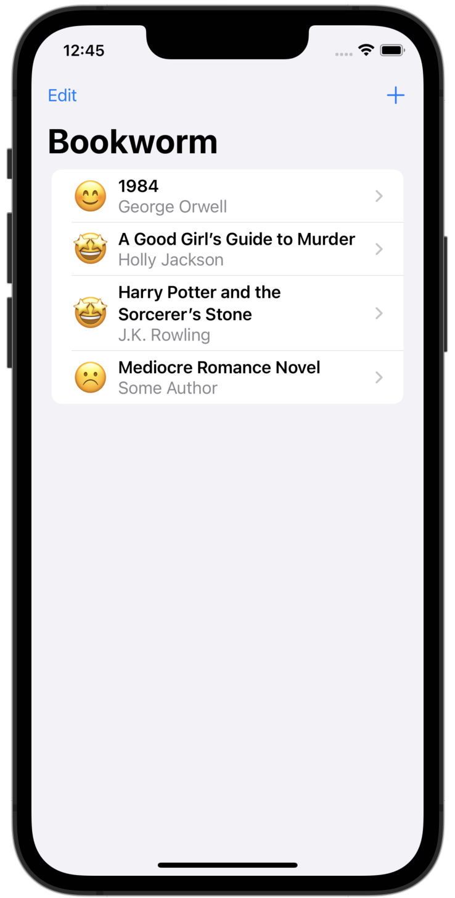
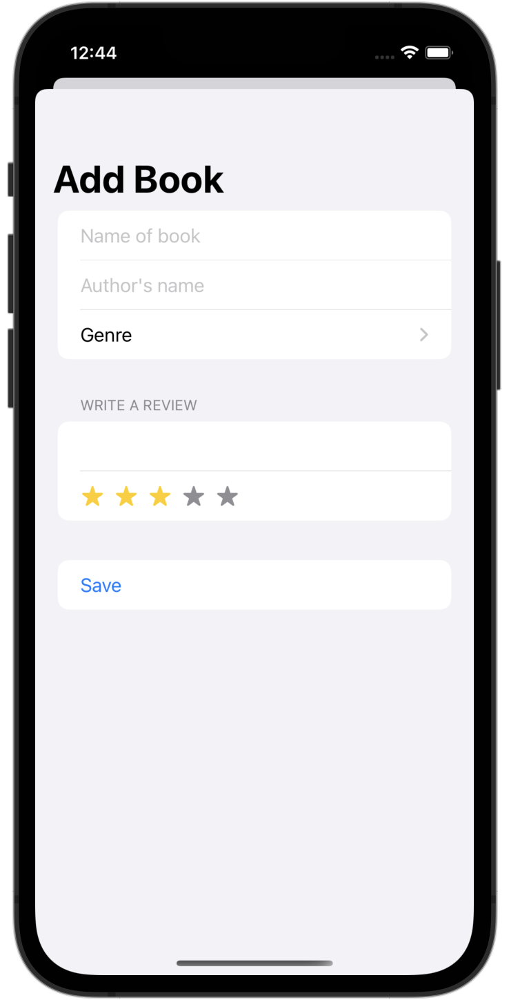
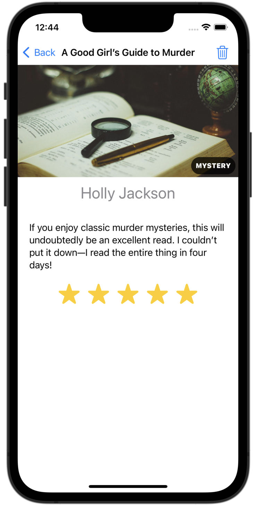
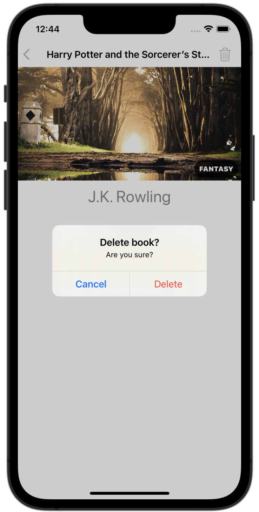

# Bookworm

A basic iOS app used to track the books a person has read along with their thoughts of them.

## Installing / Getting started 

## Features

## Credit

The idea for this project came from Paul Hudson's *100 Days of SwiftUI*. I may eventually add to this code, but credit for the base code goes to Paul Hudson. Links to each day on which material is referenced may be found below:

[Day 53 - Bookworm Part One](https://www.hackingwithswift.com/100/swiftui/53)

[Day 54 - Bookworm Part Two](https://www.hackingwithswift.com/100/swiftui/54)

[Day 55 - Bookworm Part Three](https://www.hackingwithswift.com/100/swiftui/55)

[Day 56 - Bookworm Part Four](https://www.hackingwithswift.com/100/swiftui/56)

## Screenshots

Screenshots will go here when they are ready.

<!--
-->
<!--    -->
<!--    -->
<!--    -->
<!--    -->
<!--
-->
